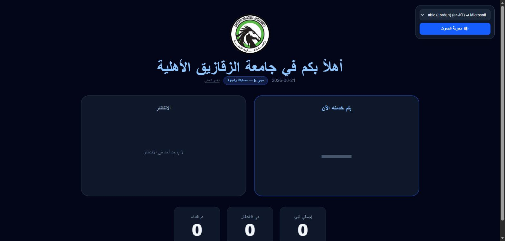
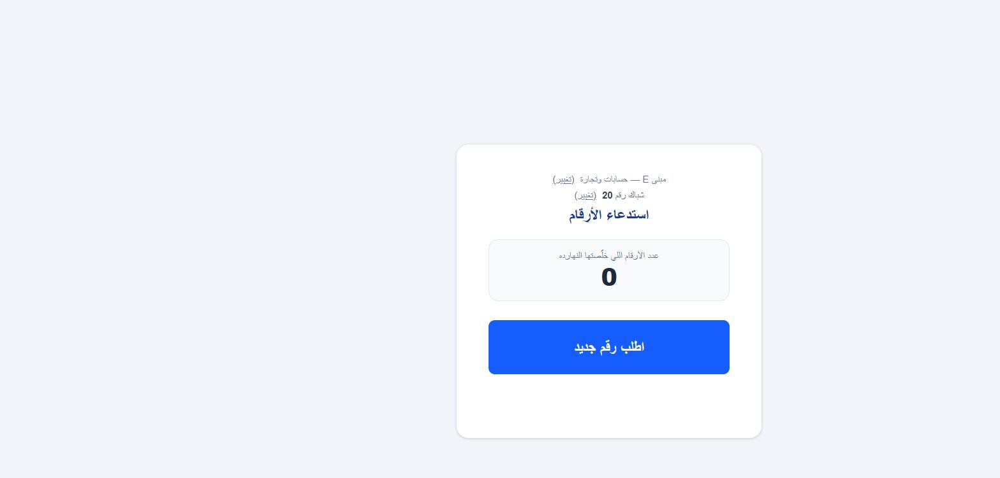

# 🎫 ZNU Queue & Ticket System — نظام طابور وتذاكر جامعة الزقازيق الأهلية

نظام إدارة طابور وطباعة تذاكر لقسم القبول في جامعة الزقازيق الأهلية، من ثلاث قطع بتشتغل مع بعض: تطبيق مكتبي لطباعة التذكرة، وشاشة عرض عامة، وصفحة استدعاء للموظف — وكلهم متزامنين لحظيًا عبر Supabase.

## لقطات من النظام وهو شغال فعليًا (النسخة المنشورة على الإنترنت)

**شاشة العرض العامة (توضح لكل قاعة وشباك رقم اللي بيتم خدمته الآن ورقم الانتظار):**



**صفحة استدعاء الأرقام (لموظف الاستقبال):**



النسخة اللي في اللقطات منشورة فعليًا على: **https://znu-counter-voice.vercel.app**

## المميزات

- **تطبيق مكتبي (Windows، PySide6)** بيطبع تذكرة برقم فريد لكل متقدّم مباشرة على الطابعة، مع ضمان إن كل رقم بيتاخد مرة واحدة بس حتى لو البرنامج قفل فجأة (الترقيم بيتسجل في SQLite محليًا قبل ما تتطبع التذكرة أصلًا).
- **مزامنة فورية مع السحابة**: كل تذكرة بتتطبع بتتبعت في الخلفية لـ Supabase (بدون ما يبطّئ عملية الطباعة نفسها)، فالشاشة العامة وصفحة الاستدعاء بيشوفوا التذكرة لحظة ما تتطبع.
- **شاشة عرض عامة (Public Display)** بتتحدّث لحظيًا (Supabase Realtime) وتوريك رقم اللي بيتم خدمته دلوقتي في كل شباك، وعدد المنتظرين، وإجمالي أرقام اليوم.
- **صفحة استدعاء للموظف (Call Next)**: زرار واحد "اطلب رقم جديد" بياخد أقدم تذكرة منتظرة ويوزّعها على الشباك، بمنطق آمن (`SECURITY DEFINER` + `FOR UPDATE SKIP LOCKED`) بحيث موظفين اتنين مايقدروش ياخدوا نفس الرقم في نفس اللحظة.
- **فصل تام بين الترقيم والاستدعاء**: جهاز الطباعة هو المصدر الوحيد لأرقام التذاكر (SQLite محلي)، والاستدعاء بيحصل بالكامل على Supabase من غير ما يرجع يأثر على الطباعة — بحيث لو النت وقع، الطباعة تفضل شغالة عادي.
- **نسخة LAN احتياطية** (FastAPI محلي) لو النت أو Vercel نزلوا، طالما جهاز الطباعة والشاشة المحلية شغالين.

## هيكل المشروع

```
app/
├── main.py            # نقطة تشغيل تطبيق سطح المكتب
├── core/              # قاعدة بيانات SQLite، الحجز، الطباعة
├── printing/          # تركيب رقم التذكرة على القالب وطباعته (GDI خام)
├── sync/              # مزامنة الخلفية مع Supabase
├── ui/                # واجهة PySide6
└── web/               # نسخة الـ FastAPI المحلية (احتياطية)
vercel-app/            # تطبيق Next.js: شاشة العرض العامة + صفحة الاستدعاء
```

## طريقة التشغيل

### تطبيق سطح المكتب (طباعة التذاكر)

```bash
pip install -r requirements.txt
python -m app.main
```

### تطبيق العرض/الاستدعاء (Next.js)

```bash
cd vercel-app
npm install
npm run dev
```

المستندات التفصيلية لكل مرحلة موجودة في الريبو: `README.md` (المرحلة 1 — تطبيق الطباعة)، `PHASE2.md` (نسخة الشبكة المحلية)، `PHASE2_WEB.md` (النسخة السحابية على Vercel/Supabase وهي المستخدمة فعليًا).
